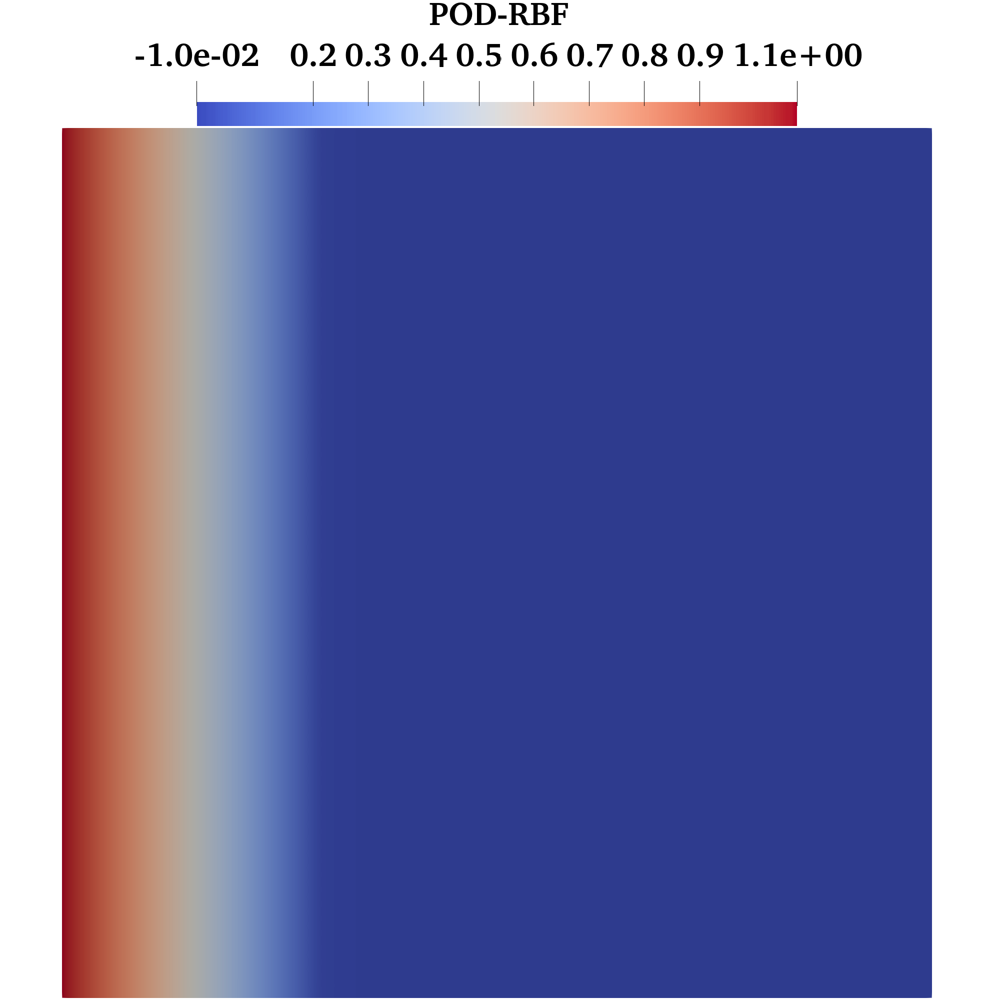
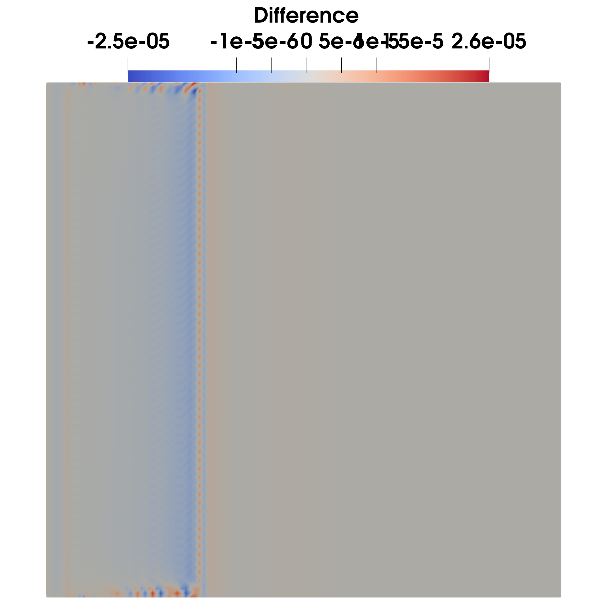
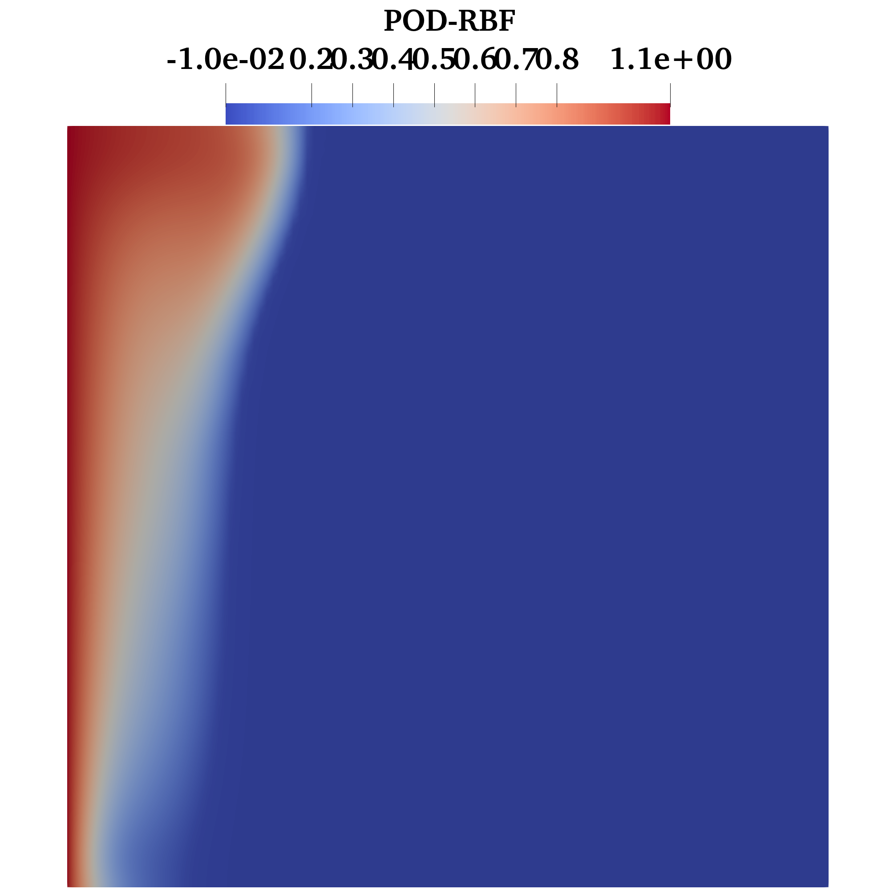
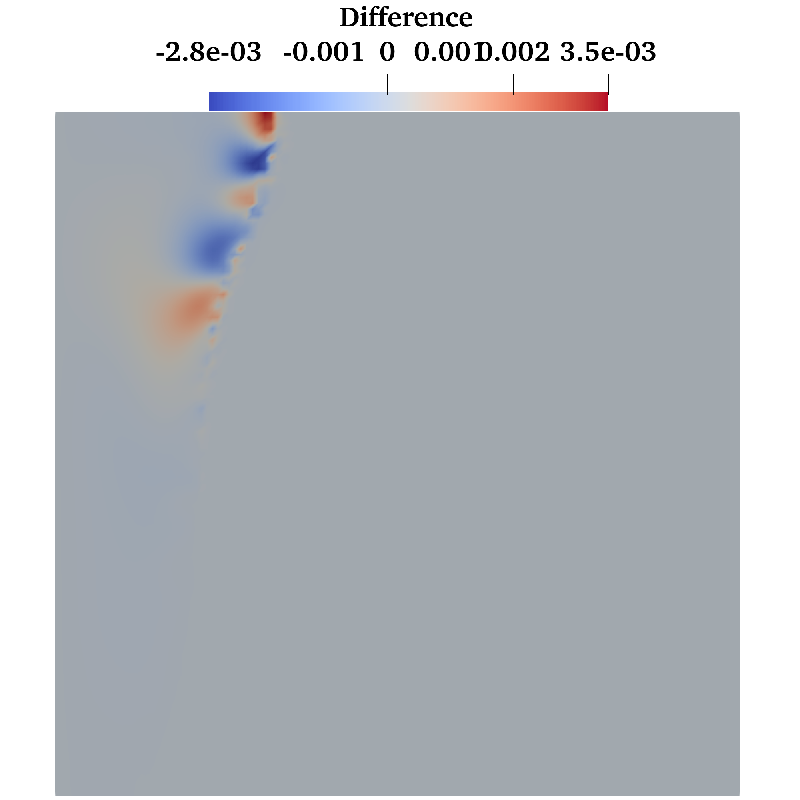

# ROMPCM
Reduced-Order Modeling for Phase Change Materials including pure conductive and nonlinear convective regimes. Conventional POD-Galerkin is compared with non-intrusive POD-RBF surogate model in both configurations. Data are uploaded from the papier:  [https://doi.org/10.1016/j.cpc.2020.107492].
- POD-Galerkin
- POD-RBF interpolation

  

## 1. Conductive phase change regime
In the conductive regime the temperature equation is governing by:

$$
\begin{aligned}
\partial_t T - \frac{1}{\mathrm{Re}\,\mathrm{Pr}} \Delta T + \partial_t S(T) &= 0,
\qquad \text{on }\Omega \times (0, t_{\max}) \\
T(\mathbf{x}, 0) &= T_0, \qquad \text{on } \Omega \\
T &= \mu, \qquad  \text{on } \partial \Gamma_l \\
\end{aligned}
$$

  
  
   
  <em>Comparaion between FOM and ROM temperature fields</em>

## 2. Convective phase change regime
In this second example, the PDE model describes the melting process of PCM governed by the Navier–Stokes–Boussinesq equations coupled with energy conservation:

$$
\nabla \cdot \mathbf{u} = 0
$$

$$
\partial_t \mathbf{u} + (\mathbf{u} \cdot \nabla)\mathbf{u} + \nabla p - \frac{1}{\mathrm{Re}} \nabla^2 \mathbf{u} =
\frac{\mathrm{Ra}\,T}{\mathrm{Pr}\,\mathrm{Re}^2}\,\mathbf{e}_y - \frac{C_{ck}(1-\zeta_l(T))^2}{\zeta_l(T)^3 + 10^{-6}}\,\mathbf{u}
$$

$$
\partial_t T+ \mathbf{u} \cdot \nabla T - \frac{1}{\mathrm{Re}\,\mathrm{Pr}} \nabla^2 T +\partial_t S(T) = 0.
$$

  
  
   
  <em>Comparaion between FOM and ROM temperature fields</em>

