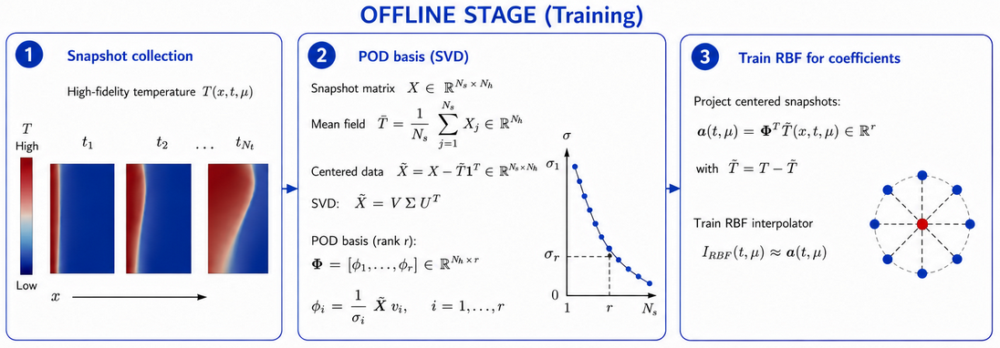

# ROMPCM: Reduced-Order Modeling for Phase Change Materials including pure conductive and nonlinear convective regimes. Conventional POD-Galerkin is compared with non-intrusive POD-RBF surogate model in both configurations. 
- POD-Galerkin
- POD-RBF interpolation
- FreeFEM
- Python
- FastAPI

  

